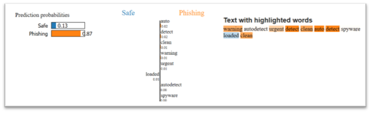

# Email Phishing Detection Using Explainable AI

## Overview

This project investigates the use of machine learning and Explainable AI for detecting phishing emails. Email text was processed using NLP techniques and TF-IDF vectorization before training and comparing multiple machine learning classifiers.

Explainable AI was then applied using LIME to understand which words contributed to individual phishing predictions.

The project also included a survey exploring users' awareness and behavior when encountering suspicious emails.

## Dataset

The project uses a public phishing email dataset containing approximately 82,800 emails classified as either:

- Safe
- Phishing

The dataset combines emails from multiple sources and includes the email subject, body, date, and sender information within a combined text field.

## Technologies Used

- Python
- Pandas
- NumPy
- Scikit-learn
- XGBoost
- TF-IDF
- LIME
- Matplotlib
- Natural Language Processing (NLP)

## Methodology

### 1. Data Preparation

- Checked the dataset for missing values and class distribution.
- Used an 80/20 stratified train-test split.
- Removed common English stop words.
- Converted email text into numerical features using TF-IDF.
- Limited TF-IDF representation to 5,000 features.

### 2. Machine Learning Models

Three machine learning models were trained and compared:

- Random Forest
- Logistic Regression
- XGBoost

### 3. Model Evaluation

The models were evaluated using:

- F1-score
- Precision
- Recall
- Accuracy
- Confusion Matrix

F1-score was used as the primary evaluation metric because both false positives and false negatives are important in phishing detection.

## Results

| Model | F1-Score | Precision | Recall | Accuracy |
|---|---:|---:|---:|---:|
| Random Forest | 98.6% | 98.7% | 98.5% | 98.6% |
| Logistic Regression | 98.3% | 98.2% | 98.4% | 98.2% |
| XGBoost | 98.0% | 97.2% | 98.7% | 97.9% |

Random Forest achieved the highest overall F1-score and was selected as the best-performing model.

## Explainable AI

LIME was used to interpret individual Random Forest predictions.

Instead of only predicting whether an email was safe or phishing, LIME helped identify which words contributed toward the model's decision.

For one test example, the model predicted an email as phishing with approximately 87% probability. LIME highlighted words including terms such as "warning" and "urgent" as contributing toward the phishing classification.

This improves model transparency by allowing users to understand why a prediction was made.

Results of the lime model: 

## Human Phishing Awareness Study

A survey was also conducted to investigate how users respond to suspicious emails and how confident they are in identifying phishing attempts.

The results indicated moderate-to-high phishing awareness among respondents, while also identifying areas where security practices could be improved.

## Limitations

- Model performance depends heavily on the dataset used for training.
- The dataset may not represent every modern real-world phishing technique.
- Even a small number of false negatives may create security risks in a real deployment.
- The phishing-awareness survey had a relatively small sample size.

## Future Improvements

- Evaluate larger and more diverse phishing datasets.
- Explore deep learning and transformer-based NLP approaches.
- Compare TF-IDF against modern text embeddings.
- Test additional Explainable AI techniques such as SHAP.
- Evaluate the system on newer real-world phishing emails.

## Key Result

**Best Model: Random Forest — F1-Score: 98.6%**
